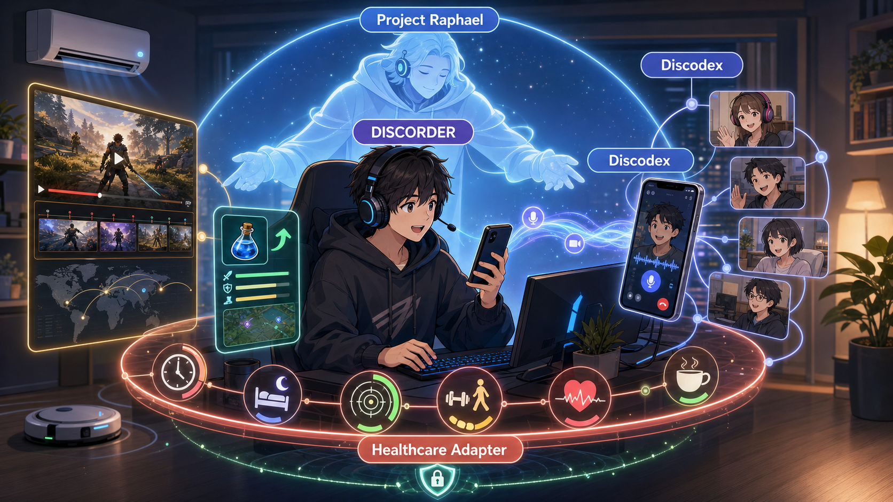

# Project Raphael

**Internal codename:** Raphael

**Public description:** AI support platform for Discord experience creators

**Repository:** [omusubiman5/discodex](https://github.com/omusubiman5/discodex)



## Navigation / 目次

- [中核定義](#core-definition)
- [DISCORDERとYouTubeの関係](#discorder-youtube)
- [Project Raphaelとは何か](#project-raphael-product)
- [完成体験](#project-raphael-experience)
- [Healthcare Adapter](#healthcare-adapter-detail)
- [Onboarding companion](#onboarding-detail)
- [Esports coach and team memory](#esports-coach-detail)
- [Discordにとっての協力価値](#discord-value)
- [Discodex Relayの製品・実行仕様](#discodex-relay-spec)
- [Discord partnership request — English one-page](#discord-partnership-request)
- [公式参照](#official-references)

<a id="core-definition"></a>

## Core definition — do not omit / 中核定義（省略禁止）

```text
DISCORDER（人間の体験creator）
  └─ Project Raphael（DISCORDER支援基盤）
       └─ Discodex（Discord接続module）
```

**DISCORDERは、ゲーム・趣向・生活・購入情報を提供する新しい人間の体験creatorである。Project Raphaelは、そのDISCORDERをAIで支援する基盤である。DiscodexはDiscordへの接続手段である。**

DISCORDERが提供するもの：

- ゲーム情報、攻略、イベント
- 個人やcommunityの趣向に合う提案
- 食事、衣服、住環境などの生活情報
- ゲーム商品や衣食住に関する購入提案
- coaching、team experience、community企画

Project Raphaelは、それらを調査・検証・個別最適化し、DISCORDERの運営と許可済み作業を支援し、Discord上で提供できる状態へ整える。

価値の流れ：

```text
DISCORDERが体験と情報を設計
→ Project Raphaelが調査・検証・個別最適化・運営を支援
→ DiscodexがDiscordへ届ける
→ 利用者がゲームと生活の支援を受ける
```

English core definition:

**A DISCORDER is a new human experience creator who provides game, preference, lifestyle, and purchasing information. Project Raphael is the AI platform that supports the DISCORDER. Discodex is the connection module that delivers the experience through Discord.**

A DISCORDER provides game information, strategies and events; recommendations matched to individual and community preferences; food, clothing and living-environment information; relevant game and lifestyle purchase guidance; coaching; team experiences; and community programs. Project Raphael researches, validates and personalizes that material and supports authorized operation. Discodex delivers the resulting experience through Discord.

## DISCORDER and YouTube

A **DISCORDER is a more personal, community-core creator who incorporates YouTube as an external content layer while using Discord as the center of the ongoing participant experience.** YouTube provides discovery, edited videos, highlights, archives and public reach. Discord provides identity, conversation, participation, personalization, services and continuity. Project Raphael connects and supports those layers.

The distinction is the **center of value**, not opposition between creators or platforms.

| Dimension | YouTuber | DISCORDER |
|---|---|---|
| Primary product | A video, livestream or media channel | A hosted, participatory Discord experience |
| Main relationship | Creator publishes; audience watches and responds | Host and participants interact continuously and influence the session |
| Core unit of value | Content, reach, views and attention | Participation, decision support, coordination and personalized outcomes |
| Participant context | Usually broad audience segments and public reactions | Permissioned identity, role, preferences, game context and session state |
| AI role | Helps create, edit, research or distribute content | Supports the host in research, validation, personalization, session operation and permitted actions |
| Typical delivery | One-to-many video or stream, synchronous or asynchronous | Voice, video, commands, roles, events and follow-up inside a persistent community |
| Commerce | Advertising, sponsorship, subscriptions and content-led sales | Community entitlements, events, services and relevant game/lifestyle purchase guidance |
| Accountability | Editorial and broadcast responsibility | Session hosting, permission boundaries, participant safety and operational responsibility |

A YouTuber can become a DISCORDER by making the Discord relationship and participatory service the core, while continuing to use YouTube as an external content and discovery channel. YouTube content becomes part of the DISCORDER experience rather than a competing product.

<a id="discorder-youtube"></a>

## DISCORDERとYouTubeの関係

**DISCORDERとは、YouTubeを外部コンテンツ層として構成に取り込み、Discordを中心に個人・communityごとの継続的な参加体験を提供する、よりパーソナルなコアcreatorである。**

YouTubeは発見、編集動画、highlight、archive、公開reachを担う。Discordはidentity、会話、参加、個別最適化、service、継続関係を担う。Project Raphaelが両者を接続・支援する。

違いは人物やplatformの対立ではなく、**価値の中心がどこにあるか**で定義する。

| 観点 | YouTuber | DISCORDER |
|---|---|---|
| 主要な成果物 | 動画、live配信、media channel | Discord上で主催する参加型体験 |
| 基本関係 | creatorが発信し、視聴者が見る・反応する | hostと参加者が継続的に対話し、sessionへ影響する |
| 価値の単位 | content、reach、再生、attention | 参加、意思決定支援、連携、個別成果 |
| 利用する文脈 | 広い視聴者層と公開reactionが中心 | 許可されたidentity、role、趣向、game文脈、session state |
| AIの役割 | 企画、制作、編集、調査、配信を補助 | hostの調査、検証、個別最適化、session運営、許可済み作業を支援 |
| 提供経路 | 同期・非同期の一対多動画／stream | 継続community内の音声、映像、command、role、event、follow-up |
| commerce | 広告、sponsor、subscription、content起点の販売 | community entitlement、event、service、game／生活に適した購入提案 |
| 責任 | 編集・発信内容への責任 | session主催、権限境界、参加者安全、運営への責任 |

YouTuberは、Discord上の継続関係と参加型serviceを中核に置くことでDISCORDERになれる。YouTube動画は競合する成果物ではなく、DISCORDER体験を構成する外部content／発見経路になる。

```text
DISCORDER（パーソナルなコアcreator）
  ├─ Discord（参加・対話・個別service・継続関係の中核）
  ├─ Project Raphael（調査・検証・個別最適化・運営支援）
  │    └─ Discodex（Discord接続module）
  └─ YouTube（外部content・発見・highlight・archive・公開reach）
```

## English summary

### User need

Players are repeatedly pulled out of games by setup questions, wiki searches, work, household tasks, notifications, and separate-device operation. The intended experience lets a player call an AI companion from smartphone Discord, authorize one game or application window, ask questions without leaving the game, receive answers through Discord voice, and delegate only explicitly permitted external tasks.

### Definition of DISCORDER

A **DISCORDER is the human Discord experience creator and host**. A DISCORDER combines games, live community interaction, participant preferences, useful game knowledge, onboarding, coaching, lifestyle information, relevant food/clothing/housing or product guidance, and explicitly authorized AI assistance into a participatory Discord experience.

A DISCORDER is not merely a one-way broadcaster. The DISCORDER selects what information and assistance are appropriate, interacts with the community, designs the session, and remains accountable for the experience.

### Product relationship

```text
DISCORDER — human creator and host
  └─ Project Raphael — AI support platform for the DISCORDER
       ├─ Discodex — Discord connection, voice/video transport and participant UI
       ├─ Raphael AI — authorized screen understanding, research and assistance
       ├─ Skills — permitted email, schedule and notification actions
       ├─ Home Assistant adapter — permitted vacuum, HVAC and lighting scenes
       ├─ Healthcare adapter — consented play time, sleep, focus, activity and health metrics
       └─ Knowledge / Coach — onboarding, game guidance, recording and comparison
```

Project Raphael supports the DISCORDER; it does not replace or outrank the DISCORDER. Discodex is the Discord connection module inside Project Raphael.

### Concrete value

- Answer questions such as “Which item is effective in this battle?” from an explicitly authorized game window.
- Reduce onboarding friction by explaining setup, controls and skills when needed instead of requiring a wiki search.
- Record an authorized boss battle, review the previous attempt with the team, and compare timing, positioning and item use afterward.
- Handle permitted email or scheduling actions and delay non-urgent interruptions until a suitable break.
- Apply allowlisted Home Assistant scenes for a robot vacuum, HVAC and lighting during and after play.
- Use consented play-time, sleep, focus, physical-activity, strength-training and health metrics to recommend breaks, session length and recovery without diagnosing or replacing medical care.
- Let a player reach the host-side companion from smartphone Discord while away from the PC.
- Give the DISCORDER a responsive, personalized creator format rather than one-way broadcasting.

### Existing result and missing official capability

Discodex has validated bidirectional Codex voice using a Windows host and Android and iPhone Discord clients. The remaining request is an officially supported way for the authorized bot itself to publish a selected game or application capture through Discord Go Live.

Discord publishes the `STREAM` permission, Voice State `self_stream`, video-related Voice Gateway history, and DAVE audio/video encryption through the official `libdave`. Public documentation does not provide a complete bot-publisher flow for Go Live signalling, video SSRC and codec negotiation, Video Sink Wants payloads, or SFU publishing.

### Safety boundaries

Project Raphael and Discodex will not automate a normal Discord user account, use a user token, rely on undocumented protocol behavior, read game memory, inject code, automate gameplay, bypass anti-cheat, expose information unavailable to the player, or provide live assistance where game or competition rules prohibit it. Health data is opt-in, purpose-limited, revocable and separated from public community data. Raphael may support habits and timing but must not diagnose, prescribe treatment or represent its output as medical advice.

### Implementation and execution policy

1. Confirm whether Discord supports bot-owned Go Live publishing.
2. Obtain the official API, Developer Preview or partner integration requirements if available.
3. Preserve the validated Discodex voice path and add video as an independently controlled capability.
4. Validate capture target, user, role, guild, channel and session identity fail-closed.
5. Verify start, viewing, reconnect, stop, rollback and permission denial with external Android and iPhone participants.
6. Run a limited DISCORDER-led pilot with anonymized measurements.
7. Do not release video publishing if Discord confirms that no supported route exists.

### Request to Discord

We request a discussion with the Discord Product or Developer Platform team about an approved bot-owned Go Live publisher path, a Developer Preview or partner-only integration, and a limited pilot for the DISCORDER creator model.

## ユーザーのニーズ

ゲーム中は、仕事、家事、検索、初期設定、操作確認、通知、別端末の操作によって没入が何度も中断される。一方で、ゲーム時間、睡眠、集中状態、運動・筋力維持、健康指標を切り離したままでは、没入と健康を両立する継続的な体験は設計できない。求める体験は、プレイヤーが外出先を含むスマートフォンDiscordからAI companionを呼び出し、明示許可したゲームまたはアプリ画面だけをAIへ見せ、ゲームを止めずに質問し、Discord音声で回答を受け、許可済み外部作業だけを委任できることに加え、本人が許可した健康・活動データを用いてplay、休憩、睡眠、運動、回復のタイミングを支援できることである。

## DISCORDERの定義

**DISCORDERとは、人間のDiscord体験creator／hostである。** ゲーム、communityのリアルタイム交流、参加者の趣向、攻略knowledge、onboarding、coaching、生活情報、衣食住に関する有用な商品・購入提案、明示許可されたAI支援を組み合わせ、Discord上の参加型体験を設計・提供する。

DISCORDERは単なる一方向の動画配信者ではない。communityと双方向に関わり、参加者と場面に適した情報・支援を選び、sessionを設計・主催し、その体験に責任を持つ人間である。

## Purpose

DISCORDERは、ゲーム、趣向、生活、健康維持、衣食住に関する情報や購入提案を組み合わせ、Discord上の参加型体験を提供する人間のcreatorである。Project Raphaelは、DISCORDERの調査、個別最適化、運営、許可済み作業をAIで支援する基盤である。Healthcare Adapterは本人同意済みのゲーム時間、睡眠、集中、活動・筋力、健康指標を安全に接続する。Discodexは、RaphaelをDiscordへ接続するmoduleである。

## Architecture

```text
DISCORDER: 体験、情報、趣向、購入提案を設計・提供
  └─ Project Raphael: DISCORDERを支援
       ├─ Discodex: Discord voice/video、mobile entrypoint、permission、session
       ├─ Raphael AI: 調査、画面理解、個別最適化、運営支援
       ├─ Skills: メール、予定、通知などの許可済み外部作業
       ├─ HAOS adapter: 掃除機、空調、照明、生活環境
       ├─ Healthcare Adapter: game時間、睡眠、集中、活動・筋力、健康指標
       └─ Knowledge/Coach: onboarding、攻略knowledge、録画、比較、team memory
```

権限検証、identity分離、監査、fail-closedはRaphael内部の安全実装であり、DISCORDERとは別のcreator roleを新設しない。

<a id="project-raphael-product"></a>

## Project Raphaelとは何か — 省略禁止

**Project Raphaelは、DISCORDERが利用者へ提供するゲーム体験を、ゲーム内の助言、ゲーム外の作業、生活環境、健康維持まで連続して支えるAI Gaming Life Companion基盤である。** 単なるbot映像配信、音声bridge、攻略検索、録画toolの名称ではない。それらを本人の許可とDISCORDERの設計に基づく一つの体験へ統合する。

利用者はスマートフォンのDiscordからProject Raphaelを呼び出す。Raphaelは許可されたゲーム画面と公式knowledgeを理解し、その場で必要な操作、技、item、攻略だけをDiscord音声で案内する。ゲームを止めてWikiを検索・通読する必要を減らし、新規購入直後、初心者、復帰者が実際に遊びながら学べるようにする。

ゲーム中にメール、予定、宅配、家事通知が届いた場合、Raphaelは本人が許可した範囲だけで返信・整理・保留を行う。HAOS Adapterは掃除機、空調、照明をgame eventとoff-timeへ連動させ、Healthcare Adapterはgame時間、睡眠、集中、活動・筋力、健康指標を接続する。目的はゲームを自動化することではなく、不要な中断を減らし、健康と生活を壊さず没入を守ることである。

```text
DISCORDERが体験を設計する
→ 利用者がスマートフォンDiscordからProject Raphaelを呼び出す
→ Discodexが音声・映像・commandを接続する
→ Raphaelがゲーム内助言と許可済みゲーム外支援を行う
→ Knowledge／Coach、Skills、HAOS、Healthcareが必要な場面だけ働く
→ 利用者はゲームを中断せず、communityと継続的な体験を共有する
```

<a id="project-raphael-experience"></a>

## Experience

Project Raphaelは、DISCORDERが設計した体験を実行時に支えるAI companion基盤である。この体験では、Discodex、画面理解、Knowledge／Coach、外部Skills、HAOS Adapter、Healthcare Adapterを、本人が許可した一つのsessionとして連携させる。

1. 許可された利用者が外出先のDiscordから、Discodexを入口としてPC上のProject Raphael sessionを起動する。
2. Project Raphaelは利用者、guild、channel、対象PC、session、各Adapterの許可範囲を検証し、不一致なら起動しない。
3. DiscodexがDiscordの公式経路でゲーム画面と音声を共有し、同じ許可済みcaptureをProject Raphaelの画面理解へ渡す。
4. 利用者は「この戦闘中に有効なアイテムは？」のようにDiscord音声でProject Raphaelへ質問する。
5. Project Raphaelは戦況・所持品・文脈を確認し、Knowledge／Coachを使ってDiscord音声で短く回答する。ゲームを自動操作しない。
6. Project Raphaelは許可済みSkillsを通じてメール、予定、家事通知を優先度別に処理し、ゲームへの不要な割り込みを抑える。
7. Project RaphaelはHAOS Adapterを通じ、allowlist済みの空調、照明、掃除機sceneをゲームeventとoff-timeへ安全に連動させる。
8. Project RaphaelはHealthcare Adapterから本人が許可した健康・活動dataだけを読み、session継続、休憩、睡眠、運動、回復の適切なタイミングを提案する。
9. session終了時、Project Raphaelは画面・音声・外部Adapterの接続を終了し、変更したrouteと生活環境を検証済みの状態へ戻して結果をreadbackする。

## HAOS control

RaphaelはHome Assistantのallowlist済みscript/sceneだけを呼び出し、ゲーム状態と生活環境を連動させる。

- **ロボット掃除機:** プレイ開始時や重要場面では一時停止し、許可されたoff-timeに再開する。
- **空調:** 室温・湿度・在室状態と利用者設定を基に、許可範囲内で設定温度・mode・fanを調整する。
- **照明:** ゲームeventごとに許可済みsceneを適用する。戦闘中は没入用scene、戦闘終了時のoff-timeは明るい回復sceneへ戻す。
- **readback:** 各操作後にHAOS entity stateを確認し、失敗時は前sceneまたは安全既定値へ戻す。

ゲームeventから直接任意device actionを生成せず、`battle_start`、`battle_end`、`off_time`などの検証済みeventを固定Home Assistant script/sceneへ対応付ける。

<a id="healthcare-adapter-detail"></a>

## Healthcare Adapter

Healthcare Adapterは、ゲーム体験を健康から切り離さず、本人が長く安全に楽しめる状態を支えるProject Raphaelの入力・助言境界である。

- **ゲーム時間:** session開始・終了、連続play時間、休憩履歴を記録し、本人設定と実績に基づいて休憩や終了候補を提示する。
- **睡眠時間:** 本人が接続を許可したsleep duration／scheduleを使い、深夜の延長、翌日の予定、回復時間を考慮したsession計画を支援する。
- **集中状態:** 反応時間、操作ミス、本人申告、許可済みwearable指標など、出所を明記できるsignalだけを扱い、集中低下を断定せず休憩候補として提示する。
- **活動・筋力:** 歩数、運動時間、strength-training履歴、長時間同一姿勢を考慮し、本人が選んだ短い運動・stretch・休憩routineを提案する。
- **健康指標:** 心拍など接続元が提供し本人が許可した数値を目的別に読み取り、閾値超過時はplay最適化より安全行動と専門家への相談を優先する。
- **個別最適化:** DISCORDERが全参加者の健康dataを見るのではなく、原則として本人とRaphaelのprivate contextで処理し、communityへは本人が明示共有した範囲だけを渡す。

Healthcare Adapterは診断、治療、投薬判断、緊急医療判定の代替ではない。推測した健康状態を事実として扱わず、接続元、測定時刻、単位、欠損、信頼性をreadbackできるdataだけを使用する。

<a id="onboarding-detail"></a>

## Onboarding companion

**Project Raphaelは、ゲーム画面と公式knowledgeを理解し、Discord音声でその場に必要な操作・技・攻略だけを案内する。新規購入者がWiki検索でゲームを中断せず、購入直後から楽しめるAI onboarding companionである。**

- 初回起動時に基本設定、操作、技、itemを現在の画面文脈に合わせて音声案内する。
- 「次に何を押すのか」「この技はいつ使うのか」「このitemは何のためか」へ、その場で短く答える。
- 公式guideまたは利用許諾されたknowledgeから必要な情報だけを回答し、根拠を示せない内容を事実として断定しない。
- 初心者、復帰者、platformごとの操作差へ説明量を適応し、spoiler範囲は利用者が選択する。
- Wikiを読む行為自体を否定せず、「プレイを止めて検索しなければ進めない」という購入直後の障壁を下げる。

<a id="esports-coach-detail"></a>

## Esports coach and team memory

録画によってProject Raphaelは、リアルタイム補佐だけでなく試合後分析を行うDiscord-native AI esports coachになる。

### ボス戦前

利用者が「ラファエル、前回のこのボス戦を見せて」と指示すると、Raphaelは許可済みarchiveから前回動画を検索し、チーム全員がDiscord上で視聴できる状態にする。全滅原因、成功した場面、装備、編成、役割、攻略手順を要約し、今回変更する点を短く提示する。

### ボス戦中

「ボス戦になったから録画して」という明示指示を受け、参加者同意、録画中表示、保存先、保持期間を確認してから録画する。ゲーム映像、ゲーム音声、チーム会話、game event、装備、party、version、日時を時刻同期し、phase移行、死亡、回復、重要item／skillなどへmarkerを残す。

### ボス戦後

「前回と比較して」という指示に対し、撃破時間、damage、回復、死亡timing、positioning、item／skillの使用順、phase移行を比較する。改善・悪化した点を映像と時刻で説明し、個人・チーム別の次回練習課題を残す。

```text
過去動画を見る
→ 作戦を決める
→ 今回を録画する
→ 前回と比較する
→ 改善策をteam memoryへ残す
→ 次の戦闘前に再利用する
```

運用modeは分離する。

- **Live Assist:** 許可された練習時だけ即時助言する。
- **Replay Coach:** 録画後に映像付きで分析する。
- **Tournament Mode:** 大会・publisher規約に従いlive助言を停止し、試合後分析だけを許可する。

## Interruption policy

- **緊急:** 即時通知
- **重要:** 戦闘終了後に通知
- **通常:** セッション終了後に要約
- **許可済み操作:** AIが代行
- **未承認操作:** 実行しない

## Required boundaries

### フェアプレイとセキュリティ境界

Project Raphaelは、hacking、cheat、ゲーム操作の自動化、anti-cheat回避を目的としない。利用するのは、許可されたプレイヤーが選択した画面上ですでに確認できる情報、公式または利用許諾されたknowledge、本人が明示提供した情報だけである。役割は助言と許可済みゲーム外支援であり、プレイヤーの代わりにplayしない。

- user、role、guild、channel、Codex task、capture targetを開始前に検証する。
- 操作者、視聴者、bot、Codex、audio、video、runnerの権限とidentityを分離する。
- 通常Discordユーザーの自動操作やuser tokenを使用しない。
- ゲームprocessへのmemory injectionや入力自動化を行わず、画面認識と助言を基本とする。
- private network解析、anti-cheat回避、プレイヤーに見えない情報の取得、無人gameplayを行わない。
- bot-owned Go LiveはDiscordが公開または明示承認したpublisher経路だけを使用する。
- HAOSはentity allowlist、値の上下限、実行者、実行理由、before/after stateを記録する。
- lock、alarm、door、garageなどのsecurity-sensitive entityはRaphaelの既定許可対象に含めない。
- Healthcare Adapterはsource、metric、利用目的、保持期間、共有先を個別許可し、いつでも撤回・削除できるようにする。
- 健康dataをDiscordの公開channel、他参加者、DISCORDERへ既定共有しない。助言とcommunity運営の権限を分離する。
- 緊急性が疑われる値ではゲーム継続を最適化せず、本人への明確な警告と地域の医療・緊急窓口の利用を優先する。

次を明示的に行わない。

- game process memoryの読み取り・変更
- gameへのcode injection
- keyboard、mouse、controller操作の自動化
- private network通信の解析
- anti-cheatやplatform securityの回避
- プレイヤーから見えない情報の取得
- プレイヤー不在でのgameplay

外部支援を禁止するgameまたはcompetitive modeではlive機能を無効化し、publisher、tournament、Discordの各規約に従う。

<a id="discord-value"></a>

## Discordにとっての協力価値

相談の核心は「bot映像配信を使いたい」だけではない。**Discordの音声・映像・identity・role・permission・command・entitlementを使い、ゲーム内助言とゲーム外の生活支援を統合する新しいAI Gaming Life Companion市場を共同検証したい。その不足部分であるbot-owned Go Liveの公式経路について協力してほしい。**

- 完成体験が具体的に定義されている。
- Discodexの双方向音声はWindows host、Android、iPhoneで実証済みである。
- open-source実装、検証環境、安全設計、DAVE知見、限定pilotの測定結果をこちらから提供できる。
- DISCORDERはYouTubeを外部contentとして使いながら、Discord上の継続的・個別的・参加型serviceを中核にする。
- 初心者onboardingは新規game購入後の離脱障壁を下げる。
- esports coachとteam memoryはcommunityの継続利用とteam活動を支える。
- entitlement、guild／user subscription、event、coaching、個別serviceへ発展できる。
- HAOSとHealthcareの接続により、単なる配信ではなく「没入と生活を両立させる」という価値を持つ。

## Current gate

Discordへ、検証可能な権限委譲型AI共同作業基盤を実現するためのbot-owned Go Live publisher経路を問い合わせる。公式経路が確認できるまで映像配信をrelease機能にしない。

<a id="discodex-relay-spec"></a>

## Discodex Relayのユーザーニーズ

Windowsでは利用者が必要なときだけ `Discodex Relay.lnk` を起動し、native appからRelayの起動・停止・状態確認と、GPT LiveからDiscordへ返す音声の出力音量を安全に操作する。Discordの `/connect`、`/disconnect`、`/status`、`/gain` を同じproductの操作面として併用する。画面共有は現行releaseに含めず、bot-owned Go Liveの公式publisher経路が確認できるまで別のfeasibility gateとして扱う。

### 利用者の操作

1. `Discodex Relay.lnk` を起動する。
2. アプリの主ボタンを押す。Codex音声routeが未準備なら、Relayが技術引数を要求せず、確認付きCodex Desktop再起動、local attachment endpoint検証、control Readyまでを一括実行する。
3. `GPT Live → Discord output volume` を25–100%で調整し、`Apply`で保存する。
4. Discordで `/connect`、`/disconnect`、`/status`、`/gain` を操作する。
5. 音声通話を切断後、必要なら `Stop Relay` でcontrolを停止する。

OSログオン時の自動起動、Scheduled Task、Windows service、custom URI、別botは使用しない。

## Discodex Relayの採用構成

```text
利用者が Discodex Relay.lnk を必要時に起動
  -> Start Relay / Stop Relay / Status / GPT Live output gain
  -> 固定 start-discord-production-control-current.ps1
  -> 既存 Discord application-command control
  -> Discord /connect
  -> 既存 logged voice runner
  -> runtime/live-call.lock
```

### Policy classification

| ID | 差分 | 判定 | 根拠 |
|---|---|---|---|
| RELAY-01 | 必要時起動のWindows Relayアプリ | required | 常駐やOS自動起動を使わず利用者が制御する |
| RELAY-02 | 固定production-control入口だけを起動 | required | 既存single-control／allowlist／Ready gateを再利用する |
| RELAY-03 | 起動mutexとbounded timeout | required | 重複controlと無応答を防止する |
| RELAY-04 | Scheduled Task／service／URI登録 | prohibited | 利用者が不採用としたOS自動起動方式 |
| RELAY-05 | 新しいbot／Gateway／runner | prohibited | 既存identityとsingle runnerを保持する |
| RELAY-06 | global audio default変更 | prohibited | 既存安全境界 |
| RELAY-07 | GPT Live→Discord出力gain UI | required | 実通話で音量過大・音割れが発生した受入結果 |
| RELAY-08 | Codex local audio routeのアプリ所有準備 | required | 利用者へdebugger endpoint設定を委ねない |
| RELAY-09 | 25–100%、既定50%、-1 dBTP limiter | required | 既存output-gain safety contract |
| RELAY-10 | bot-owned画面共有 | blocked | 公式に公開・承認されたGo Live publisher経路が未確認 |
| RELAY-11 | 通常ユーザーUI自動操作、self-bot、非公開API | prohibited | Discord公式Self-Bot方針と公開API境界 |

### 実装境界

- Relayは署名済みWindows PowerShellを固定hostにしたWindows Formsアプリとし、追加runtimeを同梱しない。
- RelayはCodex route未準備をread-only検出し、runner／lockがない場合だけ利用者の明示確認後にCodexを再起動する。graceful closeを優先し、残留時だけ事前に固定した同一Codex package process setを限定停止する。
- 固定loopback address／port、対象Codex package、app targetを検証後にのみcontrolをReadyにする。
- 配布入口は固定target／argumentsのWindows shortcutとし、未署名exeを生成しない。
- repository rootを実行位置から限定探索し、固定script以外を引数から受け取らない。
- task identityはlocal runtime fileから読み、形式不正ならprocess起動前に拒否する。
- Windows PowerShellはOS標準の固定pathを使う。
- release対象はstart／stop／status／gainの固定境界だけとし、任意commandを受け取らない。
- voice runner／lockが有効な間はアプリ終了やcontrol停止を拒否する。
- Relay自体はDiscord token、task内容、音声dataを保持・表示しない。
- 通常ユーザーアカウントのDiscord UIをCodexで自動操作しない。
- bot-owned screen shareは本書の公式承認gateを満たすまで実装しない。

## Discodex Relayの実行方針

### Build

```powershell
powershell.exe -NoProfile -ExecutionPolicy Bypass -File scripts/build-discodex-relay.ps1
```

生成物は `dist/Discodex Relay.lnk`。Enterprise signing policyを変更せず、Windows標準の署名済みWindows PowerShellで固定WinForms scriptだけを起動し、追加packageを導入しない。

### Runtime

- `runtime/discodex-relay.thread-id` に対象Codex task identityを一行で保持する。
- Relayはrepository外のscript、任意command、任意URLを受け取らない。
- 通常起動ではWindows Formsを表示し、`Start Relay`までcontrolを起動しない。
- UIはRelay／Discord voice／Codex route状態、output gain、安全範囲、既定値、limiterを表示する。
- Codex route未準備時は `Prepare Codex` を表示し、技術引数を見せずに確認付きgraceful restartとendpoint readbackを行う。
- Codex準備はrunner=0、lock=false、control<=1でのみ許可し、複数Codex root、port競合、target不一致はfail-closedとする。
- 既存controlがあれば二つ目を作らない。
- `--probe` はfile／config／prerequisiteのread-only確認だけを行う。
- `--quiet` は担当側検証用で、message boxを表示せず同じproduction入口を使う。

### Verification

1. source policy／static test
2. compiler build
3. Relay `--probe`
4. gain get／set／readbackと範囲外拒否
5. Start／Stop／Status／Gain境界のfocused test
6. control=0、runner=0、lock=falseからRelay `--quiet`
7. control=1、runner=0、lock=false、fresh `discord-ui-ready`、stderr空
8. Discord `/status`
9. 内部gate通過後のみ実 `/connect` Voice E2E

### 停止条件

- 対象Codex task、Codex Desktop root、Discord guild／channelが一意でない。
- control、runner、lockが重複している。
- DPAPI credential、VB-CABLE、route rollbackが正本gateを通らない。

### 受入条件

- Relayからcontrolを一つだけReadyにでき、状態確認とGPT Live出力gain調整ができる。
- Discordからconnect／status／gain／disconnectを操作できる。
- 実Discord Voiceで双方向会話、再参加、clipのない明瞭な返信、route rollbackを確認する。
- screen shareは別の未解決feasibility gateであり、現行releaseの合格へ含めない。

### Rollback

Relay shortcutとlocal task設定を削除しても既存script／control／runnerへ影響しない。OS registry、service、Scheduled Taskは作成しない。

## Discordへの相談事項

Discord Product／Developer Platform teamへ次を相談する。

1. bot-owned Go Live publisherの承認済み経路が存在するか。
2. Project RaphaelがDeveloper Previewまたはpartner限定経路を利用できるか。
3. DISCORDER creator modelの限定pilotを共同検討できるか。
4. 必要なproduct、安全、測定要件は何か。

提供可能な成果は、open-source音声bridge、Android／iPhone／Windowsの検証証拠、権限model、DAVE調査、prototype環境、匿名化pilot指標である。

<a id="discord-partnership-request"></a>

## Discord partnership request — English one-page

**Subject: Can Discord enable a new kind of experience creator: the DISCORDER?**

Hello Discord Developer Platform Team,

Imagine a player staying fully immersed in a game and asking through smartphone Discord:

> “Raphael, which item should I use in this battle?”

Project Raphael sees only the game or application window explicitly authorized by the player and answers through Discord voice. While the player continues playing, it can handle explicitly permitted work outside the game, such as replying to an important email, delaying non-urgent notifications, pausing a robot vacuum, optimizing the air conditioner, and changing Home Assistant lighting for a battle or a brighter post-battle break.

For a newly purchased game, Raphael explains setup, controls, skills and items at the moment they are needed. The player does not have to stop playing and search a wiki before they can enjoy the game. For a team, Raphael can show the previous authorized boss-battle recording before the next attempt, summarize what failed, record the new attempt with consent, compare timing, positioning and item use, and preserve the findings as team memory.

A consent-based Healthcare Adapter connects play time, sleep, focus, physical activity, strength-training and supported health metrics. It helps the player balance immersion with breaks, recovery and sustainable routines. It does not diagnose, prescribe treatment or expose private health data to the community by default.

A **DISCORDER** is the human creator and host who designs this experience. A DISCORDER provides game knowledge, events, coaching, community programs, preference-based recommendations, lifestyle information and relevant purchasing guidance. **Project Raphael** researches, validates, personalizes and operates the authorized support. **Discodex** is the open-source Discord connection module that carries the mobile entrypoint, permissions, voice, video, commands and session controls.

YouTube is not a competitor in this model. It is an external content, discovery, highlight and archive layer. Discord is the personal core: identity, conversation, participation, services and ongoing community relationships.

Project Raphael is not intended for hacking or cheating. It does not read game memory, inject code, automate controls, inspect private traffic, bypass anti-cheat, expose hidden information or play without the user. Games or competitive modes that prohibit external assistance use post-match analysis only.

Discodex has already validated bidirectional Codex voice through Discord using a Windows host and Android and iPhone clients. The missing component is an officially supported way for the authorized bot itself to publish a selected game or application capture through Go Live. We will not automate a normal Discord account, use a user token or rely on undocumented protocol behavior.

We are asking Discord to discuss the DISCORDER creator model and Project Raphael as a limited pilot, not merely to answer a protocol question. Discord could enable a new AI Gaming Life Companion experience that combines onboarding, coaching, team memory, community services and authorized life support around games. We can provide the open-source voice bridge, implementation evidence, permission model, DAVE findings, prototype environment and anonymized pilot measurements.

Would Discord be interested in discussing an approved bot-owned Go Live publisher path, Developer Preview or partner integration for this limited pilot?

Repository: https://github.com/omusubiman5/discodex

Complete bilingual project and technical brief: https://github.com/omusubiman5/discodex/blob/master/docs/PROJECT_RAPHAEL.md

Best regards,

Project Raphael / Discodex

<a id="official-references"></a>

## Official references / 公式参照

- [Discord Permissions](https://docs.discord.com/developers/topics/permissions)
- [Discord Voice Connections](https://docs.discord.com/developers/topics/voice-connections)
- [Discord Voice Resource](https://docs.discord.com/developers/resources/voice)
- [Discord Voice Opcodes](https://docs.discord.com/developers/topics/opcodes-and-status-codes)
- [DAVE Protocol](https://daveprotocol.com/)
- [Discord `libdave`](https://github.com/discord/libdave)
- [Discord Social Layer for Games](https://docs.discord.com/developers/platform/social-layer)
- [Discord Claim Your Game](https://docs.discord.com/developers/platform/claim-your-game)

## Naming

`DISCORDER`は人間の体験creator、`Raphael`はDISCORDER支援基盤のinternal project codename、`Discodex`はDiscord接続moduleおよび既存repositoryとする。公開名称・説明・画像では第三者作品との提携や公式性を示唆せず、`AI companion`を使用する。
